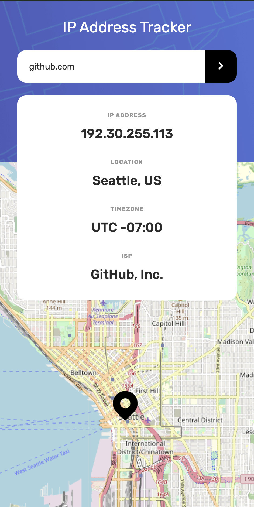

# IP address tracker solution - Frontend Mentor

This is a solution to the [IP address tracker challenge on Frontend Mentor](https://www.frontendmentor.io/challenges/ip-address-tracker-I8-0yYAH0). Frontend Mentor challenges help you improve your coding skills by building realistic projects. 

## Table of contents

- [Overview](#overview)
  - [The challenge](#the-challenge)
  - [Screenshot](#screenshot)
  - [Links](#links)
- [My process](#my-process)
  - [Built with](#built-with)
- [Author](#author)

## Overview

### The challenge

Users should be able to:

- View the optimal layout for each page depending on their device's screen size
- See hover states for all interactive elements on the page
- See their own IP address on the map on the initial page load
- Search for any IP addresses or domains and see the key information and location

### Screenshot

### Links

- Solution URL: [Live Solution URL](https://johnbroers.github.io/IPAddressLocator/)

## My process

### Built with

- Semantic HTML5 markup
- SCSS
- Flexbox
- Mobile-first workflow
- ES6
- Webpack 5
- [IPify](https://geo.ipify.org/) - IP Geolocation API
- [Leaflet](https://leafletjs.com/) - Interactive Maps API

## Author

- Website - [John Broers](https://johnbroers.nl)
- Frontend Mentor - [@JohnBroers](https://www.frontendmentor.io/profile/JohnBroers)
- Twitter - [@johnbroerss](https://twitter.com/johnbroerss)
